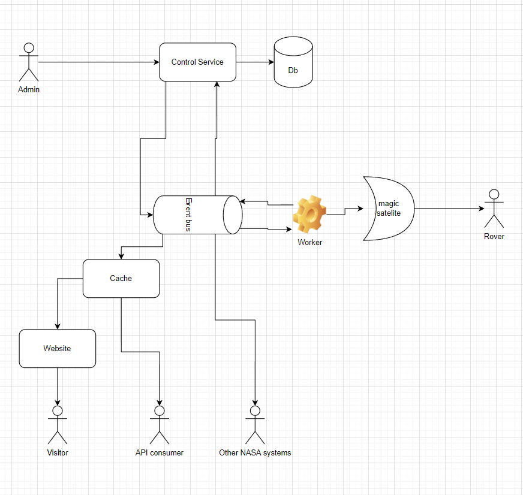

# Architectural Design

## Assumptions

This system is mission-critical and as such needs to be as simple and minimal as possible: the less moving parts, the less chance something breaks.

There is the assumption that the rover does not move continuously: i.e. once a command it sent it will move 1 "step" and then wait for further input.

## Design

Since communication with the rover might be interrupted at any time, it is important to have the rover send acknowledgements (ACK) for every command received. In order to prevent duplicate commands being sent, every ACK should contain a message ID so that the command can be marked complete.

The sending and receiving of rover ACK can be done by a `Worker` process that can wait for a longer time without blocking the control service itself. Once the worker receives the ACK an event is raised so that the control service can mark the command as executed.

Due to the use of an event bus for commands it is easy for other consumers to see what is happening, without the possibility of them impacting the mission critical services.

Visitors and API consumers don't require the most up-to-date information and as such can make use of a cache to serve static locations. This can also be used by other NASA systems (such as building a dashboard for example).

This design is flexible in technologies as they communicate via an event bus and as such the data can easily be parsed by other systems. This allows each service to use the technology best suited to their use case.

It should be said that there should be workers available at all times to process the ACK returned by the rover. 

The choice of database depends on the service. For the control service it is quite inconsequential as long as there are guaranteed writes. The website for tracking the current position does not need any database: a cache holding the latest X entries should be enough. For the history I would recommend any sort of event sourced system as that works nicely together with the event bus and replaying the history of how the rover has been commanded.